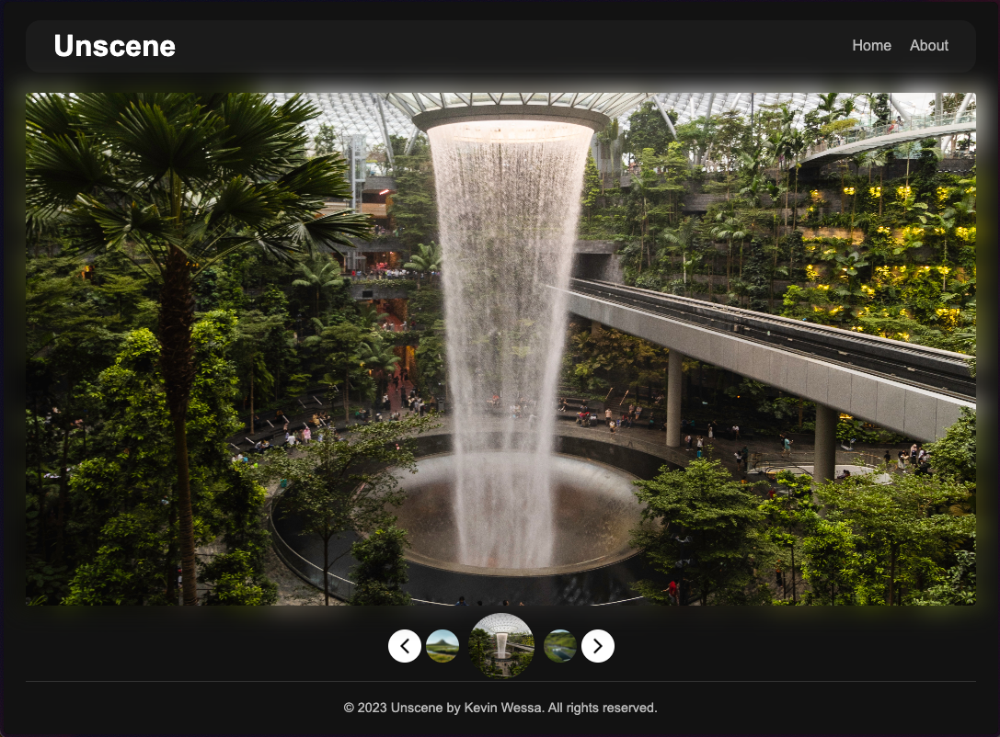

# Unscene: Unsplash Photo App

## About The Project

Unscene is a tribute to our planet's astonishing beauty. In today's digital age, while we're often engulfed in the humdrum of everyday life, we sometimes forget to pause and appreciate the natural splendors surrounding us. Unscene offers that serene pause, acting as a window to the breathtaking landscapes that our world hosts.

**Built with:** [JavaScript](https://www.javascript.com/) • [React](https://react.dev/) • [React Router](https://reactrouter.com/)

## Access the project

[Access the app here](https://keen-nougat-eca329.netlify.app/)

### Features

- The 10 latest photos from the Unsplash API
- An immersive experience with a slight glow of the photo's color
- Infinite carousel for the latest photos
